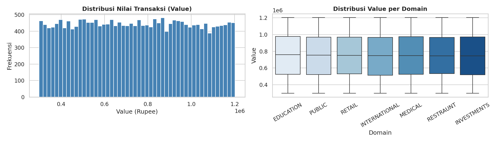
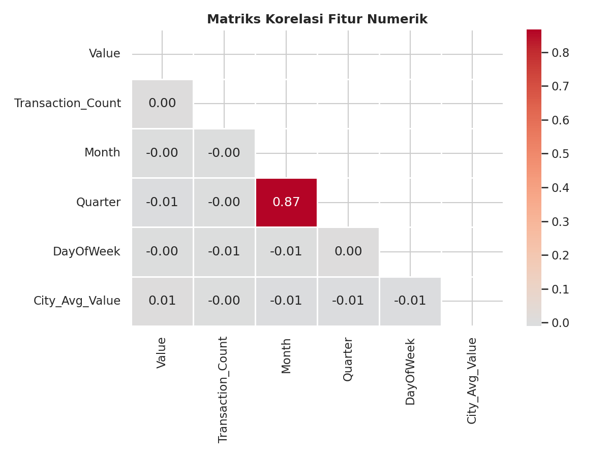
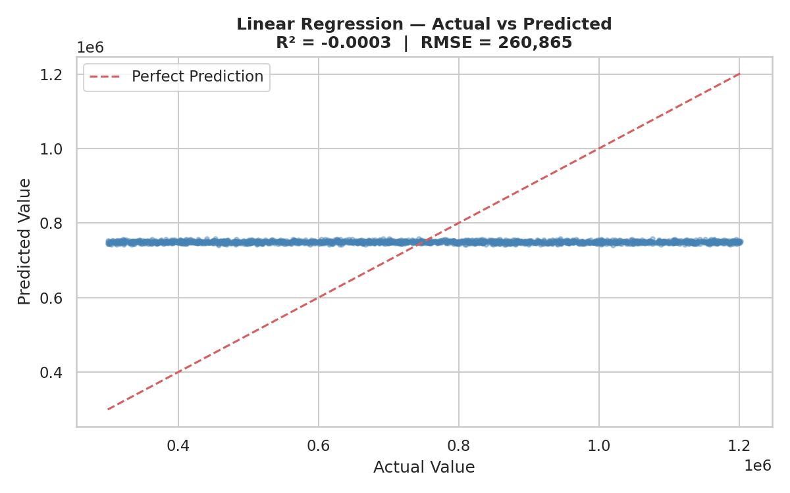
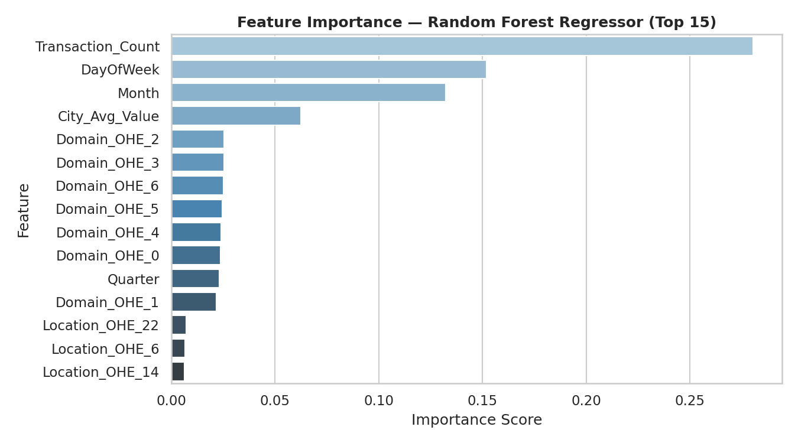

# Machine Learning — Massive Bank Dataset (1 Juta Baris)

Pemodelan Machine Learning end-to-end pada dataset transaksi perbankan India berskala besar (±1 juta baris), menggunakan **Apache Spark (PySpark MLlib)** di Google Colab — mulai dari EDA, feature engineering, hingga 5 model regresi, klasifikasi, dan clustering.

## Dataset
- Sumber: [Kaggle — Massive Bank Dataset](https://www.kaggle.com/datasets/ksabishek/massive-bank-dataset-1-million-rows)
- Jumlah baris: ±1.000.000
- Domain transaksi: Investments, International, Retail, Restaurant, Medical, Public, Education

## Tools & Tech Stack
- **PySpark** (Spark SQL & MLlib) — pemrosesan data skala besar & pemodelan terdistribusi
- Pandas, Matplotlib, Seaborn — visualisasi
- Google Colab — environment eksekusi

## Alur Kerja
1. **Load & Preprocessing** — baca CSV dengan Spark, bersihkan data (dropna/dedup), ekstraksi fitur waktu (Year, Month, Quarter, DayOfWeek, DayOfYear)
2. **Exploratory Data Analysis** — distribusi nilai transaksi per domain & matriks korelasi fitur numerik
3. **Analisis Spark SQL** — 5 query agregasi (performa per domain, tren bulanan/kuartalan, top kota, segmentasi nilai transaksi, pola per hari)
4. **Pemodelan Machine Learning** — lihat tabel di bawah
5. **Evaluasi & Perbandingan Model**

## Model yang Dibangun

| # | Model | Tipe | Target | Fitur Utama |
|---|-------|------|--------|--------------|
| 1 | Linear Regression | Regresi | `Value` (nilai transaksi) | Month, Quarter, DayOfWeek, Year, Transaction_Count, Domain, Location, City_Avg_Value |
| 2 | Random Forest Regressor | Regresi | `Value` | sama seperti di atas |
| 3 | Logistic Regression (Multinomial) | Klasifikasi (7 kelas) | `Domain` transaksi | Month, Quarter, Value, Transaction_Count, City_Avg_Value, Location |
| 4 | Random Forest Classifier | Klasifikasi (7 kelas) | `Domain` transaksi | sama seperti di atas |
| 5 | K-Means Clustering | Unsupervised | Segmentasi transaksi | Value, Transaction_Count, Month, Quarter, City_Avg_Value |

## Hasil Evaluasi Model

| Model | Metrik | Hasil |
|---|---|---|
| Linear Regression | R² | ≈ -0.0001 |
| Random Forest Regressor | R² | ≈ -0.0001 |
| Logistic Regression | Accuracy | 14.43% |
| Random Forest Classifier | Accuracy | 14.33% |
| K-Means (k=4) | Silhouette Score | 0.3519 |

## Insight Utama
1. **Model supervised (regresi & klasifikasi) menghasilkan performa mendekati baseline acak** (R² ≈ -0.0001; akurasi ~14% untuk 7 kelas, setara 1/7). Ini bukan kegagalan implementasi, melainkan konsekuensi dari karakteristik dataset yang **terdistribusi seragam (uniform)** — nilai transaksi dan label domain tidak memiliki pola yang bisa dipelajari dari fitur yang tersedia
2. Analisis Spark SQL mengonfirmasi keseragaman ini: seluruh 7 domain punya jumlah record & rata-rata nilai transaksi yang nyaris identik, dan **100% transaksi jatuh dalam kategori "Premium" (>100K Rupee)**
3. **K-Means Clustering justru lebih robust** terhadap data seragam ini — menghasilkan Silhouette Score 0.3519 (struktur segmentasi lemah-moderat) dan berhasil membentuk 4 segmen nasabah yang bisa diinterpretasikan secara bisnis (Premium/High Value, Ritel Aktif, Menengah Pasif, Rendah/Dormant)
4. Menariknya, model yang lebih sederhana (Linear Regression, Logistic Regression) sedikit mengungguli model ensemble (Random Forest) pada kedua paradigma supervised — konsisten dengan sifat data yang tidak diskriminatif
5. Seluruh pipeline (feature engineering → training → evaluasi) dibangun modular menggunakan Spark ML `Pipeline`, sehingga mudah direproduksi pada dataset lain yang punya struktur lebih heterogen

> 📌 Detail metodologi dan pembahasan lengkap tersedia di paper: *Analisis Big Data Transaksi Perbankan Menggunakan PySpark*.

## Visualisasi

## Cara Menjalankan
1. Buka file `BigdataBank.ipynb` di Google Colab
2. Upload `bankdataset.csv` (dari Kaggle, dataset di atas) ke `/content/` saat diminta
3. Jalankan seluruh cell secara berurutan dari atas ke bawah
4. Hasil model & profil klaster otomatis tersimpan ke `ml_model_results.csv` dan `ml_cluster_profiles.csv`
